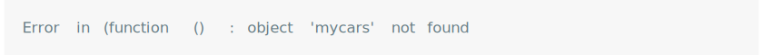
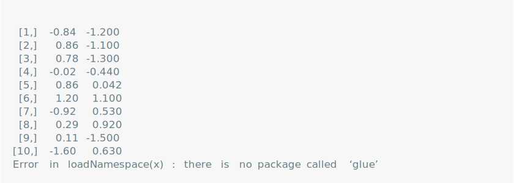

<!-- README.md is generated from README.Rmd. Please edit that file -->

# jetty 

<!-- badges: start -->
<!-- badges: end -->

> Execute R functions or code blocks within a Docker container.

It may be useful, in certain circumstances, to perform a computation in
a separate R process that is running within a Docker container. This
package attempts to achieve this!

## Features

- Calls an R function with arguments or a code block in a subprocess
  within a Docker container.

- Copies function arguments (as necessary) to the subprocess and copies
  the return value of the function/code block.

- Discovers and installs required packages in the Docker container at
  run-time.

- Copies error objects back from the subprocess. In general, these error
  objects do not include the stack trace from the Docker R process.
  However, if for example the error is an rlang error, it will include
  the full stack trace.

- Shows and/or collects the standard output and standard error of the
  Docker subprocess.

## Install

To install jetty from GitHub:

``` r
# install.packages("pak")
pak::pkg_install("dmolitor/jetty")
```

## Synchronous, one-off R processes in a Docker container

Use `run()` to execute an R function or code block in a new R process
within a Docker container. The results are passed back directly to the
local R session.

``` r
jetty::run(function() var(iris[, 1:4]))
```

<picture>
<source media="(prefers-color-scheme: dark)" srcset="man/figures/README-/unnamed-chunk-3-dark.svg">

</picture>

### Specifying Docker container

The desired Docker container can be set via the `image` argument, and
should be specified as a string in standard Docker format. These formats
include `username/image:tag`, `username/image`, `image:tag`, and
`image`. The default choice is `r-base:{jetty:::r_version()}` which is a
bare-bones R image that mirrors the R version running locally. For
example, the following command would be executed in the official
[`r-base`](https://hub.docker.com/_/r-base) image with the latest
version of R, which comes with no packages beyond the base set
installed:

``` r
jetty::run(function() var(iris[, 1:4]), image = "r-base:latest")
```

### Passing arguments

You can pass arguments to the function by setting `args` to the list of
arguments, similar to the base `do.call` function. This is often
necessary, as the function being evaluated in the Docker R process does
not have access to variables in the parent process. For example, the
following does not work:

``` r
mycars <- cars
jetty::run(function() summary(mycars))
```

<picture>
<source media="(prefers-color-scheme: dark)" srcset="man/figures/README-/unnamed-chunk-5-dark.svg">

</picture>

But this does:

``` r
mycars <- cars
jetty::run(function(x) summary(x), args = list(mycars))
```

<picture>
<source media="(prefers-color-scheme: dark)" srcset="man/figures/README-/unnamed-chunk-6-dark.svg">

</picture>

### Using packages

You can use any package in the child R process, with the caveat that the
package must be installed in the Docker container. While it’s
recommended to refer to it explicitly with the `::` operator, the code
snippet can also call `library()` or `require()` and will work fine. For
example, the following code snippets both work equally well:

``` r
jetty::run(
  {
    library(Matrix);
    function(nrow, ncol) rsparsematrix(nrow, ncol, density = 1)
  },
  args = list(nrow = 10, ncol = 2)
)
```

<picture>
<source media="(prefers-color-scheme: dark)" srcset="man/figures/README-/unnamed-chunk-7-dark.svg">

</picture>

and

``` r
jetty::run(
  function(nrow, ncol) Matrix::rsparsematrix(nrow, ncol, density = 1),
  args = list(nrow = 10, ncol = 2)
)
```

<picture>
<source media="(prefers-color-scheme: dark)" srcset="man/figures/README-/unnamed-chunk-8-dark.svg">

</picture>

#### Installing required packages

jetty also supports installing required packages at runtime. For
example, the following code will fail because the required packages are
not installed in the Docker image:

``` r
jetty::run(
  {
    my_name <- "Daniel"
    glue::glue("Hello {my_name}")
  }
)
```

<picture>
<source media="(prefers-color-scheme: dark)" srcset="man/figures/README-/unnamed-chunk-9-dark.svg">

</picture>

However, by setting `install_dependencies = TRUE` we can tell jetty to
discover the required packages and install them before executing the
code:

``` r
jetty::run(
  {
    my_name <- "Daniel"
    glue::glue("Hello {my_name}")
  },
  install_dependencies = TRUE,
  stdout = TRUE
)
```

<picture>
<source media="(prefers-color-scheme: dark)" srcset="man/figures/README-/unnamed-chunk-10-dark.svg">

</picture>

**Note**: this feature uses
[`renv::dependencies`](https://rstudio.github.io/renv/reference/dependencies.html)
to discover the required packages, and won’t handle all possible
scenarios. In particular, it won’t install specific package versions
(just the latest version) and it will only install packages that are on
CRAN. Use this with care!

### Error handling

jetty copies errors from the child R process to the main R session:

``` r
jetty::run(function() 1 + "A")
```

<picture>
<source media="(prefers-color-scheme: dark)" srcset="man/figures/README-/unnamed-chunk-11-dark.svg">

</picture>

Although the errors themselves are propagated to the main R session, the
stack trace is (currently) not propagated. This means that calling
functions such as `traceback()` and `rlang::last_trace()` won’t be of
any help.

### Standard output and error

By default, the standard output and error of the Docker subprocess are
printed to the R console. However, since jetty uses `system2()` to
execute all Docker commands, you can specify the `stdout` and `stderr`
arguments which will be passed directly to `system2()`. For example the
following code will print a series of text to the console:

``` r
jetty::run({for (i in 1:5) cat("iter", i, "\n"); TRUE})
```

<picture>
<source media="(prefers-color-scheme: dark)" srcset="man/figures/README-/unnamed-chunk-12-dark.svg">

</picture>

But you can discard this output by setting `stdout = FALSE`:

``` r
jetty::run({for (i in 1:5) cat("iter", i, "\n"); TRUE}, stdout = FALSE)
```

<picture>
<source media="(prefers-color-scheme: dark)" srcset="man/figures/README-/unnamed-chunk-13-dark.svg">

</picture>

To see more details on controlling `stdout` and `stderr`, check out the
[documentation
here](https://stat.ethz.ch/R-manual/R-devel/library/base/html/system2.html).
